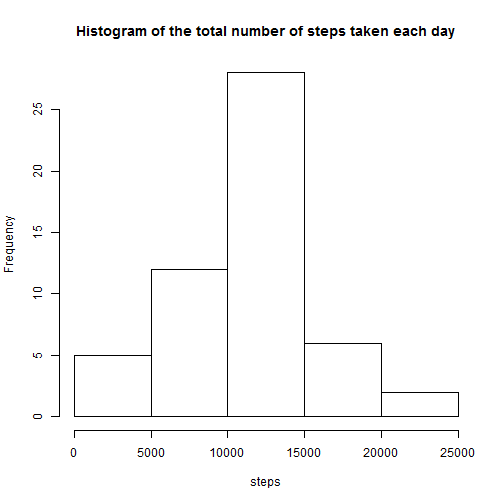
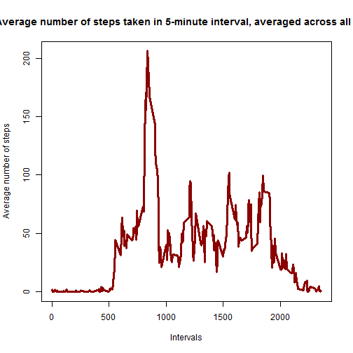
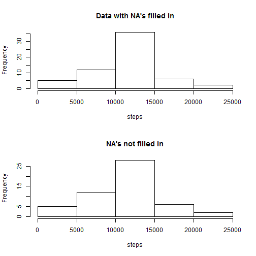
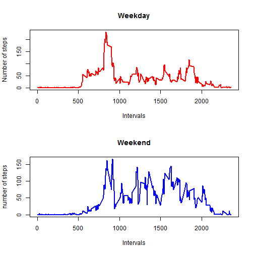

# Wearable Pedometer/Activity Tracker Mini-Study

It is now possible to collect a large amount of data about personal movement using activity monitoring devices such as the Fitbit, Nike Fuelband, Galaxy Gear Fit or Jawbone Up. These type of devices are part of the "quantified self" movement -- a group of enthusiasts who take measurements about themselves regularly to improve their health, to find patterns in their behavior, or to affiliate themselves with the tech community. But, typically, this data remains under-utilized both because the raw data are hard to obtain and because there is a lack of statistical methods and software for processing and interpreting the data that are easily understood by the layperson.

The following short study makes use of data obtained from a personal activity monitoring device. This device collected pedometer (step tracking) data from an anonymous subject at 5 minute intervals through out the day for two months (October ~ November, 2012).

## Loading and preprocessing the data


```r
library(dplyr)

setwd("c:/dev")
data<-read.csv("activity.csv", sep=',', header=TRUE)  # loading data
data <- mutate(data, hour = interval %/% 100, minute = interval %% 100)
```


## What is mean total number of steps taken per day?


```r
daily<-c()  # This will be the total number of steps taken per day


for (i in 1:61){ # total number of days in October and November is 31+30=61
    start<-(i-1)*288+1  # 288 five-minute steps in a day; 24*60/5=288
    last<-(i-1)*288+288
    temp<-data[start:last,1]    # extracting all 5-minute steps for each day
    daily<-c(daily,sum(temp))   # concatenating the daily totals  
}

daily_noNA<-daily[!is.na(daily)]  # 8 NA's are removed

hist(daily_noNA, xlab="steps",ylab="Frequency",
     main="Histogram of the total number of steps taken each day")
```




Mean


```r
mean(daily,na.rm=T)
```

```
## [1] 10766.19
```

Median


```r
median(daily,na.rm=T)
```

```
## [1] 10765
```


## What is the average daily activity pattern?

Which 5-minute interval, on average across all the days in the dataset, contains the maximum number of steps?


```r
x<-data[,1]         # number of steps in 5-minute intevals
y<-matrix(x,288,61) # so as to get average of 5-minute intevals across all days  

five_average<-apply(y,1,mean,na.rm=TRUE)  # 5-minute interval average number of steps taken, 
# averaged across all days

plot(data$interval[1:288],five_average, type='l',col='darkred',
     xlab='Intervals',lwd=3,
     ylab='Average number of steps',
     main ='Average number of steps taken in 5-minute interval, averaged across all days')
```



Which 5-minute interval, on average across all the days in the dataset, contains the maximum number of steps?


```r
hr<-data$hour
min<-data$minute

hr_max<-hr[which(five_average==max(five_average))]
min_max<-min[which(five_average==max(five_average))]

cat('The maximum number of steps occurs at',hr_max,':',min_max,'AM')
```

```
## The maximum number of steps occurs at 8 : 35 AM
```


## Imputing missing values


```r
sum(is.na(data[,1]))
```

```
## [1] 2304
```


```r
five_average_rep<- rep(five_average,61)

data1<-data   # creating a copy of the datset so as to not mess up the original data

for (i in 1:length(data1[,1])){  # there are 61 days
    
    if(is.na(data1[i,1])==TRUE){
        data1[i,1]= five_average_rep[i]  # missing values replaced
    }}
```

    
    

```r
daily1<-c()


for (i in 1:61){              #  the total number of days in October and November is 31+30=61
    start<-(i-1)*288+1        #  there are 288 five-minute steps in a day; 24*60/5=288
    last<-(i-1)*288+288
    temp<-data1[start:last,1]    # extracting all 5-minute steps for each day
    daily1<-c(daily1,sum(temp))   # concatenating the daily totals 
}
```


```r
par(mfrow=c(2,1))

hist(daily1, xlab="steps",ylab="Frequency",
     main="Data with NA's filled in")

hist(daily_noNA, xlab="steps",ylab="Frequency",
     main="NA's not filled in")
```




### Are there differences in activity patterns between weekdays and weekends?

Create a new factor variable in the dataset with two levels - "weekday" and "weekend" indicating whether a given date is a weekday or weekend day.


```r
data1$date<-as.Date(data1$date)

data1$day<-weekdays(data1$date)

# I have to use the weekdays name in Portuguese because of my machine time location. The R function weekdays return the names in Portuguese

data1_weekdays<-data1[(!data1$day %in% c("sábado","domingo")),]  # weekdays

data1_weekend<-data1[(data1$day %in% c("sábado","domingo")),]   #  weekend

weekday_steps<-data1_weekdays[,1]

temp<-matrix(weekday_steps,nrow=288)

weekday_steps_average<-apply(temp,1,mean)


weekend_steps<-data1_weekend[,1]

temp<-matrix(weekend_steps,nrow=288)

weekend_steps_average<-apply(temp,1,mean)
```

Make a panel plot containing a time series plot (i.e. type = "l") of the 5-minute interval (x-axis) and the average number of steps taken, averaged across all weekday days or weekend days (y-axis)


```r
par(mfrow=c(2,1))

plot(data$interval[1:288],weekday_steps_average, type="l",xlab='Intervals',ylab="Number of steps",
     col='red',lwd=2, main="Weekday")

plot(data$interval[1:288],weekend_steps_average, type="l", xlab='Intervals',ylab="number of steps",
     col='blue',lwd=2,main="Weekend")
```




